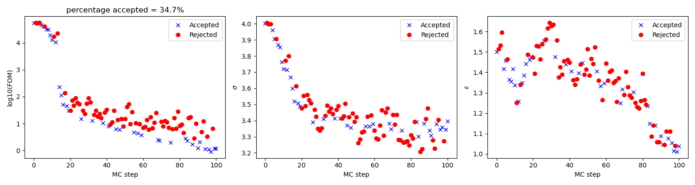
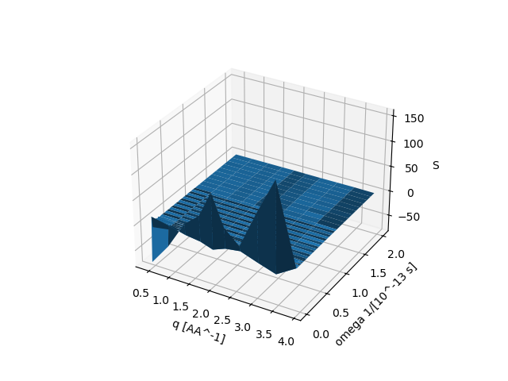
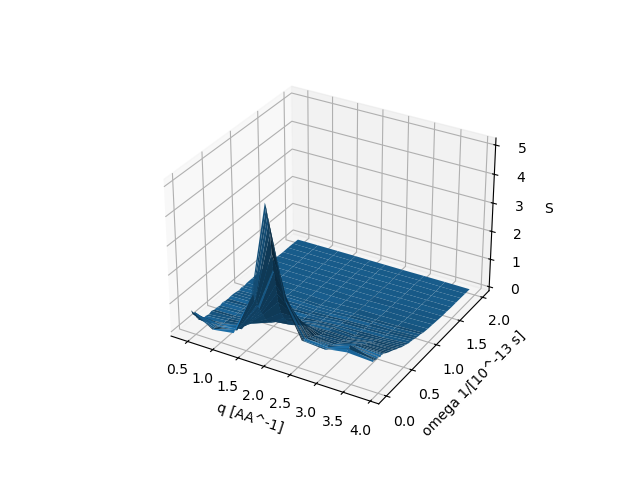
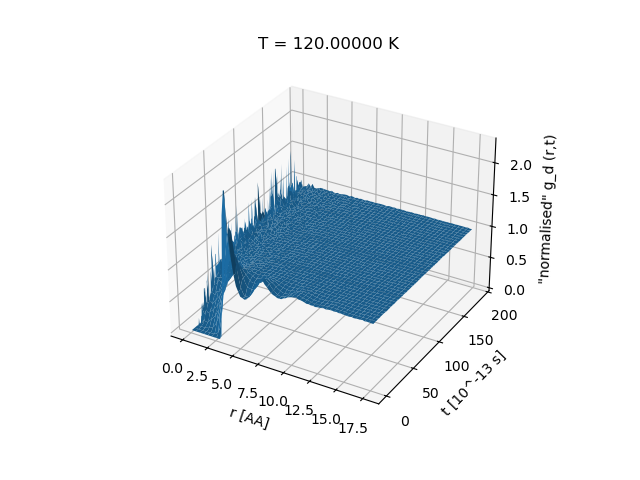

# MDMC

This software was created to test a new algorithm for fitting/optimising Potential Energy (PE) parameters against dynamical information such as S(q,omega) and S(q,t).

A zip file containing Windows executable, user manual, scripts for plotting, example MDMC job files and Argon test data is available for download from https://github.com/MDMCproject/MDMC/releases.

Documentation related to and referenced to in the code can be found in source code directory doc.

Library used by this software
-----------------------------

This software uses the XML reader/writer library called xmlf90, a copy of which
is located in src/xmlf90-1.2. For more information about this library see 
https://github.com/rscircus/xmlf90 (xmlf90 is 3-clause BSD license which is compatible with GNU GPL).

To compile source code
----------------------

**Options available prior to Dec 2025**

* Intel Microsoft Visual studio: Open mdmc.sln in /src and compile.
* Other platforms: in /src find both a traditional makefile and SCons makefile scripts (named SConstruct and SConscript) is available (possibly a bit out of date).

**Dec 2025 added compile option, and test of it**

Previous compile options appear to not longer be working out of the box. Since better build tools now availble (since the previous compile options were added a decade(s) ago), here, rather than attempting to update existing build script instead added cmake support and with gfortran. 
Also added python versions of the plotting scripts. 

To compile and test this Dec 2025 option follow the instructions below (needs an environment with gfortran, cmake and python (tested on Ubuntu 24.04.1 with gfortran 13.3.0, python 3.13.9 and cmake 3.28.3)):

* download this repo to a folder, in this demo assumed this to be `/repo/mdmc/`
* somewhere else : `mkdir build`
* then : `cd build/`
* then : `cmake /repo/mdmc/src`
* then : `make`
* then : `cp /repo/mdmc/src/input/mdmc_control_time_corr_argon.xml bin/`
* then : `cp /repo/mdmc/data/Van_Well_thesis_Ag_data/Well_s_q_omega_Ag_data_unsymmetrised.xml bin/`
* then : `cd bin/`
* then : `./mdmc mdmc_control_time_corr_argon.xml`.
Wait for it... about 5-6 hours on a standard laptop ano Dec 2025. Note the code is single threaded and therefore no gain or little gain from running on a high performance cluster. Also, noticed that when running this gfortran compiled version it ran noticably lower than the above previous ifortran compiled version on this Windows - WSL enabled laptop. I did not look into whether this was because of a gfortran compiler flag issue or an WSL feature.
* Then : `python /repo/mdmc/src/output/analyseMDMCrun.py output/mdmc_results.xml`, 
which will display

The above subplot on the left shows how drastically the figure-of-merit (FOM) drops as the two force-field parameters are adjusted to fit experimental argon s(q,omega) data, and the two subplots on the right how these two force-field parameters changes as a function of MC steps.
* Then : `python /repo/mdmc/src/output/read_s_q_omega.py output/first_s_q_omega.xml`

The above plot shows s(q,omega) for the molecular dynamic equilibrium calculated starting point with force-field parameters sigma=4 and epsilon=1.5. As can be seen, argon is, with the MD-engine and force-field parameters used, in crystalline-ish state. For a more direct view of this, plot output/first_g_d.xml using /repo/mdmc/src/output/read_G_s.py. This will show g_d(r,t), that is the time-dependent pair distribution function, and as shown in the plot below at t=0, g_d, looks crystalline-ish and this staying the same as t increases i.e. showing that the atoms moving about much wihtin the MD simulation box.

* Then : `python /repo/mdmc/src/output/read_s_q_omega.py output/best_s_q_omega.xml`

This plot shows s(q,omega) for the best obtained values of the force-field parameters. For g_d(r,t) comparison also below see the corresponding best g_d(r,t), which shows no longer in a crystalline-ish state.

The above shows and test that the Dec 2025 compiled version reproduces results from the technical report: https://epubs.stfc.ac.uk/work/36113739 .
