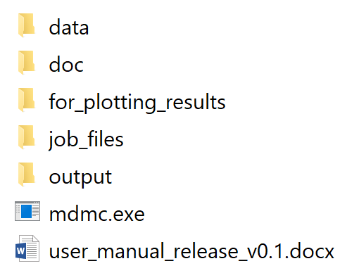
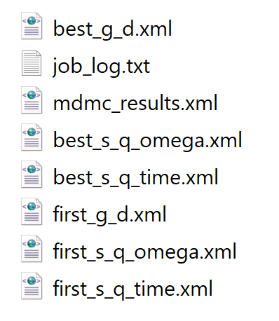
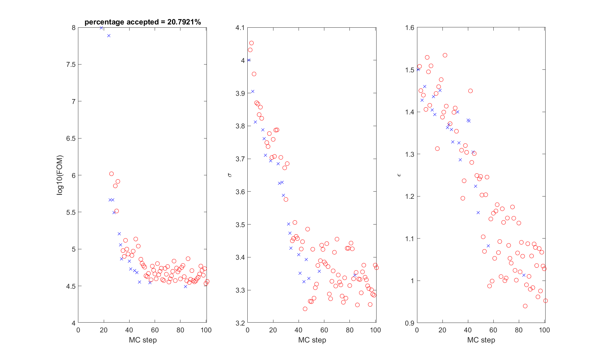
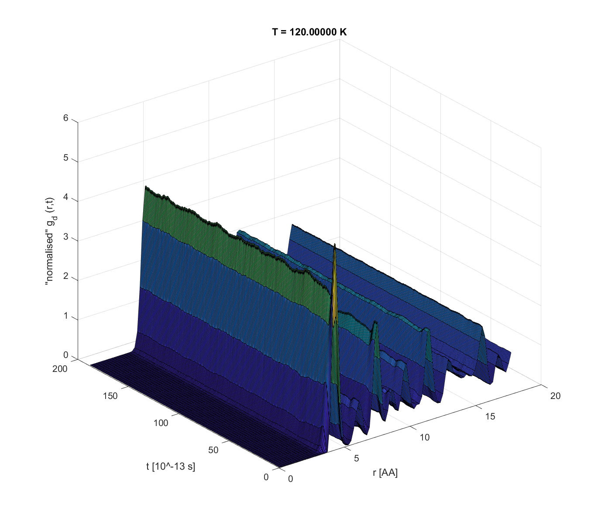
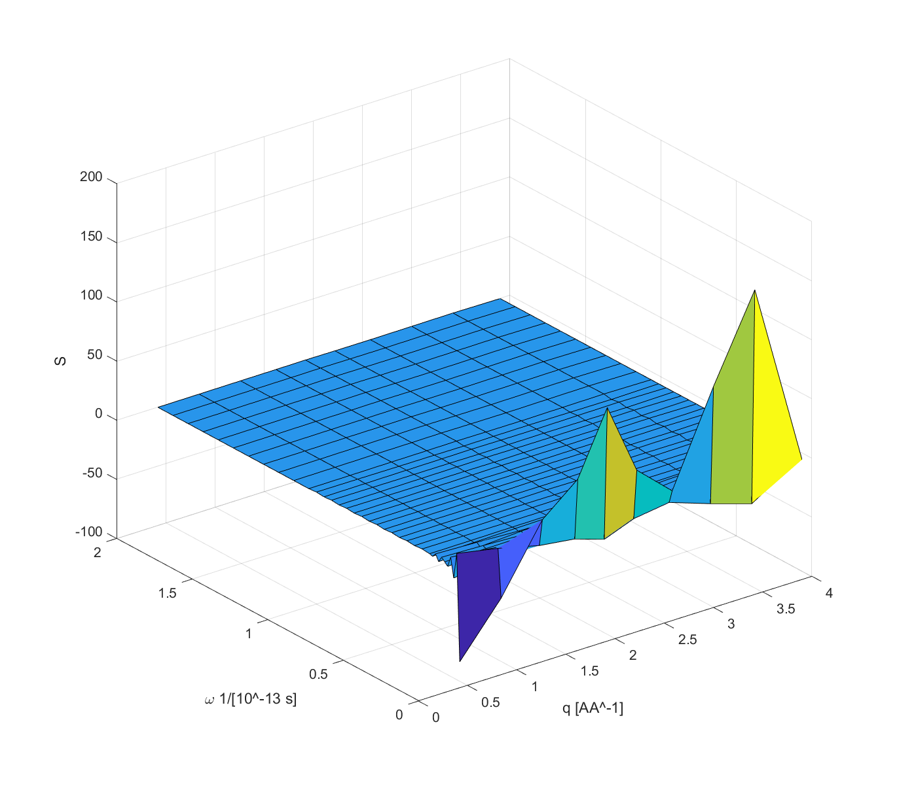
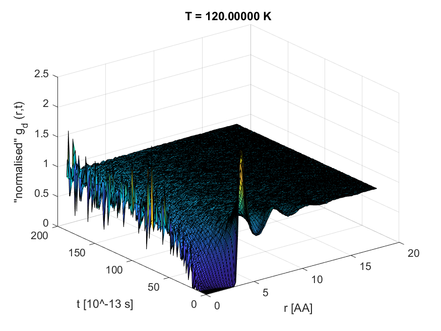
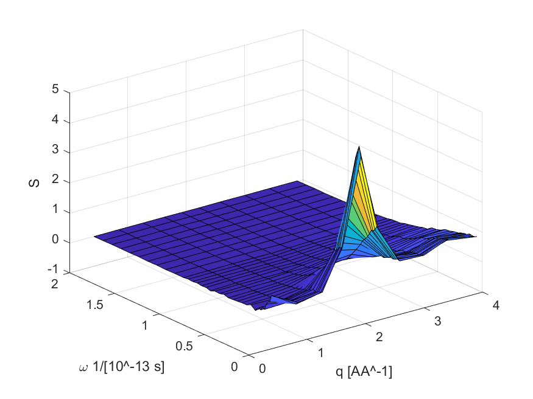

# blah
This tutorial go through in some detail how to recreate the results in the 
technical report: https://doi.org/10.1103/PhysRevA.31.3391.

Please note when below refer to `mdmc` this should be read as `mdmc-fortran`. 
The code described in this tutorial was created purely to test an algorithm
and not for user comsumption. A code designed for this purpose is being 
constructed. In due course this code will be named `mdmc` the code repository
be renamed to `mdmc-fortran` (or some other name that convey that this code
been superceeded).

First step is to either download the Window executable via the zip file
`mdmc_release_v0.1.zip` available from
https://github.com/MDMCproject/MDMC/releases/tag/v0.1 or as also explained in
[README.md](../../README.md) compile the code on your platform of choice;
please note (as of this writing) this has not been done for a while (and
anyone please don't hesitate to contribute any updates to these back to this
repository). 

Here will run the code via the Windows executable in zip file. The folder 
structure of this zip file is (closely mirrows the folder structure within the
`src` folder of the this repo):

The executable is, not surprisingly, `mdmc.exe`. As explained in
``user_manual_release_v0.1.docx`` this executable take one input which is a
job-file. Examples of these are in the folder `job_files`. Of particular
interest here is the job-file `job_files\mdmc_control_time_corr_argon.xml`.
Note, `mdmc.exe` is using no form of threading and/or MPI and to run 100 
Monte-Carlo accept/reject step using a Intel(R) Core(TM) i7-8705G CPU @ 3.10GHz
takes about 5 hours, where 100 MC-steps is sufficient to demonstrate and
reproduce the essential features of the results in the technical report. Hence,
open `job_files\mdmc_control_time_corr_argon.xml` in a file editor and change 
`mc-steps number="200"` to `mc-steps number="100"`. Alternatively, copy this 
[file](tech_report_annotated_input_file/tech_report_annotated_job_file.xml):
identifical to `job_files\mdmc_control_time_corr_argon.xml` except annotated
to be easier to read for the pupose of this tutorial and with MC-step=100.

This code was developed to test an algorithm and not developed to be user
much beyond that purpose. Please bear this in mind.

OK, now, run `mdmc.exe` and when asked provide the name of the above
configured job-file e.g. `job_files\mdmc_control_time_corr_argon.xml`. Then
wait for about ~5 hours (depending on the processor of your computer of course)
and optionally watch the terminal output and FF refinement onfold. 

In addition to the in terminal output, a series of files are written to the
folder `output`. These are

Most of these are self-explanatory, expect perhaps for `job_log.txt` which 
contains details of during executation that may be useful debugging or here
here more detailed comparisons, and `mdmc_results.xml` which contain the 
Monte Carlo accept/reject history with values. An example of mdmc output
(which will vary in details for each run of `mdmc.exe` because of random number
generation, but not in interpretation) see files in this
[folder](example_output).

The easiest way to interpret these outputs are through plots. The folder
`for_plotting_results` contains Matlab scripts for this purpose (Matlab is a
nice software, but is not free sorry, this scripts written some time ago,
from a quick search just now there exist a number of tools for translation
these to python e.g. see https://www.pythonpool.com/convert-matlab-to-python/ )
(anyone welcome to contribute python version of these back to the repo).

To view the refinement, within Matlab and from location `for_plotting_results`
type `analyseMDMCrun("..\output\mdmc_results.xml")`, which will display

where blue crosses and red circles are accepted and rejected steps respectively.
As can be seen start from sigm=4 and epsilon=1.5 and refine from that point. At
this sigma/epsilon point argon equilibriates to a crystalline-ish state, as
seen below, showing the dynamical pair-distribution function and dynamical structure factor function at this point (using `read_G_d('..\output\first_g_d.xml')` and
`read_s_q_time("..\output\first_s_q_time.xml")`):

G_d(r,t)                   |  S(q,omega)
:-------------------------:|:-------------------------------:
  | 

As can been seen from the refinement the sigma and epsilon quickly refine
towards values of sigma and epsilon that transform argon into a liquid and 
towards the expected values of these parameters, where for this refinement
the best values came out as sigma = 3.345758 and epsilon = 1.013166 (see end
of `job_log.txt`) which are getting close to van Well et al. 1985 published
values: sigma=3.36 and epsilon=1.0243. Likely if ran for more than 100 MC steps
the best sigma/epsilon point would get closer to the published values, however,
as should be clear when getting closer the FOM extramum the users could play
around with reducing the MC temperature () or parameter MD parameters to run
the MD in less of a meta-stable state and therefore longer simulations but
more numerical accurate within the boundary of the newtonian simulation
(further in the replacement of this code we go a step further and allow the
user to experiment with there own minimizers). At sigma = 3.345758 and
epsilon = 1.013166 argon takes the shape:

G_d(r,t)                   |  S(q,omega)
:-------------------------:|:-------------------------------:
  | 

within the blah folder type blah to view
the refinement history of the sigma and epsilon lennard-jones parameters, and 
as shown below

 